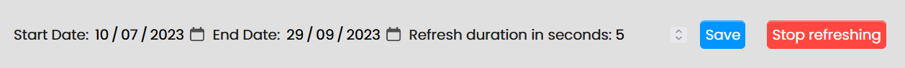

# The script
This UserScript script was created for Bukit Batok Driving Center (BBDC)'s booking session especially practical booking. This script will notify you if there is an available slot to be booked. Currently, this script has very basic features which will inform you via your browser notification if any slots are available. I might increase the number of features if I feel motivated to code.

# Requirement
As this is a UserScript, it needs browser extension such as TamperMonkey, https://www.tampermonkey.net/, to execute it. TamperMonkey is available in the extension store for both Firefox and Google Chrome.

# Features
* Notify you if there are any slots available in the booking page.
* Choose the date range to look out for slots
   * Only filter by months for now

# Usage
1. Install TamperMonkey from your browser extension store.
2. Add this script into TamperMonkey and enable it if need to.
   * Check if the script is detected
   
   

3. Go to https://booking.bbdc.sg/#/booking/chooseSlot?courseType=3C&insInstructorId=&instructorType=
   * Make sure you are in the calendar booking page before enabling this script.

   

4. Once enabled, refresh the page by pressing F5.
5. In the left end of your URL search bar, press the pop-up bubble and allow notification.
6. If there are slots available, notification should appear on the right on your computer.
7. Press the "Stop refreshing" button before booking any slots.
8. You may select the date range that you would like to be notified of any available slots.
9. You may also change the refresh rate.
   * Minimum is 5 seconds to prevent server from timeout us.

